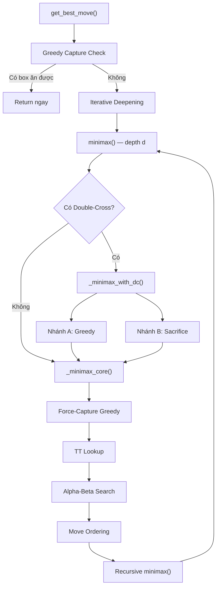
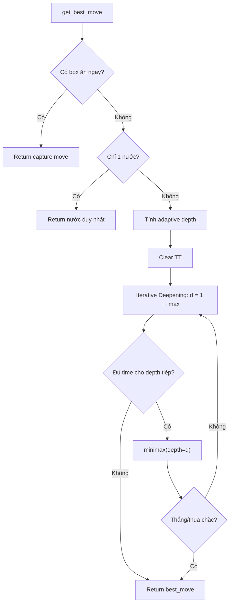
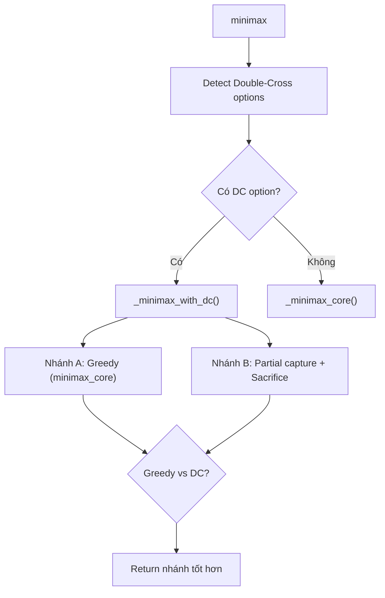
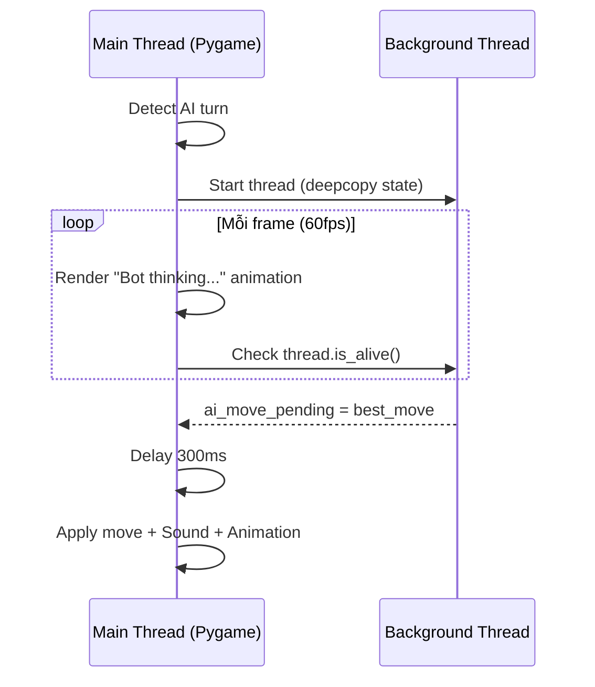

# 🤖 Dots & Boxes AI — Tài liệu Kỹ thuật

## 1. Tổng quan Kiến trúc

AI sử dụng thuật toán **Minimax với Alpha-Beta Pruning**, được tối ưu hóa bằng nhiều kỹ thuật chuyên biệt cho game Dots & Boxes. Toàn bộ logic nằm trong file `ai.py`.



---

## 2. Thuật toán Minimax + Alpha-Beta Pruning

### 2.1 Nguyên lý Minimax

Minimax mô hình hóa game 2 người chơi dưới dạng **cây trạng thái**:
- **Maximizer** (AI): chọn nước có điểm **cao nhất**
- **Minimizer** (đối thủ): chọn nước có điểm **thấp nhất**

```
            MAX (AI)
           /    |    \
         5     3      7      ← MIN chọn min mỗi nhánh
        /|\   /|\    /|\
       5 8 2 3 9 1  7 4 6   ← evaluate() tại lá
```

AI đệ quy từ gốc đến lá (depth = 0 hoặc game kết thúc), rồi **lan truyền ngược** giá trị tốt nhất.

### 2.2 Alpha-Beta Pruning

Cắt tỉa các nhánh **chắc chắn không ảnh hưởng đến kết quả**:
- `alpha`: giá trị tốt nhất mà MAX đã đảm bảo
- `beta`: giá trị tốt nhất mà MIN đã đảm bảo
- Nếu `alpha >= beta` → **cắt nhánh** (không cần tìm thêm)

> **Hiệu quả**: Giảm branching factor từ `b` xuống `√b` trong trường hợp tốt nhất, tức tìm kiếm sâu gấp đôi trong cùng thời gian.

**Code** — [_minimax_core()](file:///c:/Users/ACER/Downloads/Game-Dots-and-Boxes/ai.py#L621-L713):
```python
if is_max:
    best_val = -math.inf
    for move in ordered:
        val, _ = minimax(state, depth - 1, alpha, beta, ai_player)
        alpha = max(alpha, val)
        if alpha >= beta:
            break  # Beta cutoff — MIN sẽ không chọn nhánh này
```

---

## 3. Tối ưu hóa Tốc độ

### 3.1 Transposition Table (TT)

**Vấn đề**: Nhiều thứ tự nước đi khác nhau dẫn đến **cùng 1 trạng thái** → tính lại lãng phí.

**Giải pháp**: Cache kết quả trong dictionary `_tt` với key = `(h_edges, v_edges, current_player)`.

```python
# TT Entry: (depth, score, flag, best_move)
# flag: EXACT | LOWERBOUND | UPPERBOUND
```

| Flag | Ý nghĩa |
|------|---------|
| `EXACT` | Giá trị chính xác tại depth này |
| `LOWERBOUND` | Giá trị thực ≥ score (do beta cutoff) |
| `UPPERBOUND` | Giá trị thực ≤ score (do alpha cutoff) |

**Code** — [TT lookup](file:///c:/Users/ACER/Downloads/Game-Dots-and-Boxes/ai.py#L643-L662):
```python
if key in _tt:
    tt_depth, tt_score, tt_flag, tt_mk = _tt[key]
    if tt_depth >= depth:
        if tt_flag == EXACT:
            return tt_score, ...       # Dùng ngay
        elif tt_flag == LOWERBOUND:
            alpha = max(alpha, tt_score)  # Thu hẹp cửa sổ
        elif tt_flag == UPPERBOUND:
            beta = min(beta, tt_score)
```

### 3.2 Force-Capture Optimization

**Insight**: Trong D&B, ăn box **luôn có lợi** (được điểm + extra turn). Không bao giờ nên bỏ qua.

**Tối ưu**: Thay vì phân nhánh trên capture moves, **ăn hết tất cả** trước khi phân nhánh → giảm branching factor cực lớn.

```
TRƯỚC (không force-capture):        SAU (có force-capture):
        Node                              Node
       / | \                          Force-capture tất cả
     C1  C2  Non-capture              → Chỉ phân nhánh non-capture
    / \  / \    |                          / | \
   ... ...  ...  ...                     NC1 NC2 NC3
```

**Code** — [_force_captures_greedy()](file:///c:/Users/ACER/Downloads/Game-Dots-and-Boxes/ai.py#L189-L218): Lặp quét board tìm box 3 cạnh → ăn → lặp lại cho đến khi không còn.

### 3.3 Iterative Deepening

Tìm kiếm từ depth 1 → depth max, kết quả depth thấp cải thiện TT move ordering cho depth cao.

```python
for d in range(1, max_depth + 1):
    # Ước lượng: nếu không đủ time → dừng
    if d > 2 and (elapsed + last_iter_time * 5) > time_limit:
        break
    score, move = minimax(state, d, ...)
    if abs(score) >= 9000:  # Thắng/thua chắc → dừng sớm
        break
```

### 3.4 Move Ordering

Thứ tự thử nước đi ảnh hưởng **cực lớn** đến hiệu quả Alpha-Beta:

```
Ưu tiên:
1. TT Best Move    — nước tốt nhất từ iteration trước
2. Safe Moves      — không tạo box 3 cạnh cho đối thủ
3. Risky Moves     — tạo box 3 cạnh (sắp theo số box tạo ra)
```

### 3.5 Adaptive Depth

Tự động tăng depth khi game gần kết thúc:

| Moves remaining | Depth |
|:---:|:---:|
| ≤ 10 | min(remaining, 22) — **giải hoàn toàn** |
| ≤ 16 | base + 4 |
| ≤ 22 | base + 2 |
| ≤ 30 | base + 1 |
| > 30 | base |

### 3.6 Auto-Scale theo Board Size

| Board | Tổng cạnh | Base depth |
|:---:|:---:|:---:|
| 3×3 | 24 | 6 |
| 4×4 | 40 | 4 |
| 5×5 | 60 | 3 |
| 7×7+ | 112+ | 2 |

---

## 4. Chiến thuật Dots & Boxes

### 4.1 Phân loại Cấu trúc Board

Game D&B chia board thành các vùng:

```
Box 0 cạnh: An toàn hoàn toàn (2 nước mới thành nguy hiểm)
Box 1 cạnh: Tương đối an toàn
Box 2 cạnh: "Chain material" — có thể thành chain/loop
Box 3 cạnh: CẦN ĂN NGAY — bất kỳ ai đi cũng phải ăn
Box 4 cạnh: Đã bị ăn
```

### 4.2 Open Chain vs Closed Loop

**Code** — [_analyze_chains_and_loops()](file:///c:/Users/ACER/Downloads/Game-Dots-and-Boxes/ai.py#L376-L451)

```
OPEN CHAIN (dãy thẳng):          CLOSED LOOP (vòng kín):

  [B1]—[B2]—[B3]—[B4]            [B1]—[B2]
                                   |       |
  Mỗi box: 2 cạnh                [B4]—[B3]
  Nối bằng cạnh chưa vẽ
  Có ≥1 đầu "mở" (1 neighbor)    Mọi box: đúng 2 neighbors
```

**Thuật toán phát hiện** (BFS):
1. Quét tất cả box chưa bị ăn, có ≥ 2 cạnh
2. BFS qua các cạnh chưa vẽ tìm connected component
3. Đếm adjacency mỗi box trong component:
   - **Mọi box có 2 neighbors** → Closed Loop
   - **Có box < 2 neighbors** → Open Chain

### 4.3 Double-Cross (Sacrifice 2)

Chiến thuật quan trọng nhất trong D&B cạnh tranh.

**Tình huống**: Chain mở dài ≥ 3 box, box đầu có 3 cạnh.

```
Greedy (ăn hết):
  Ăn B1→B2→B3→B4→B5 (+5 box)
  → Phải đi nước non-capture → có thể MỞ chain cho đối thủ

Double-Cross (sacrifice 2):
  Ăn B1→B2→B3 (+3 box)
  → Vẽ cạnh chung B4–B5 (sacrifice edge)
  → B4 và B5 đều có 3 cạnh
  → ĐỐI THỦ BUỘC ăn B4+B5 (+2 box)
  → Đối thủ phải đi non-capture → MỞ chain khác cho ta!

  Net: Ta được 3 box, đối thủ được 2 box, TA GIỮ QUYỀN CONTROL
```

**Code** — [_find_double_cross_options()](file:///c:/Users/ACER/Downloads/Game-Dots-and-Boxes/ai.py#L227-L316)

### 4.4 Quad Sacrifice (Sacrifice 4) — Closed Loop

Tương tự Double-Cross nhưng cho vòng kín.

```
Loop 8 box:
  [B1]—[B2]—[B3]—[B4]
   |                 |
  [B8]—[B7]—[B6]—[B5]

Greedy: Ăn hết 8 box → mất quyền control

Quad Sacrifice:
  Ăn B1→B2→B3→B4 (+4 box)
  → Vẽ cạnh giữa B6–B7 (chia thành [B5–B6] + [B7–B8])
  → Đối thủ ăn cả 4 box còn lại
  → Đối thủ phải mở chain tiếp → ta ăn chain đó!

  Net: Ta 4, đối thủ 4, TA GIỮ CONTROL
```

### 4.5 Closed Chain Full Sacrifice — Chuỗi Đóng

Khi **cả 2 đầu** chain đều có 3 cạnh, capture từ 1 đầu sẽ **cascade** qua toàn bộ chain → **không thể dừng giữa chừng** → double-cross bất khả thi.

```
Closed chain: [B1(3)]—[B2(2)]—[B3(2)]—[B4(3)]

Tại sao cascade?
  Ăn B1 → vẽ cạnh chung B1-B2 → B2 lên 3 → PHẢI ăn B2
  Ăn B2 → vẽ cạnh chung B2-B3 → B3 lên 3 → PHẢI ăn B3
  Ăn B3 → vẽ cạnh chung B3-B4 → B4 lên 4 → TỰ ĐỘNG ăn!
  → Ăn 1 = ăn hết 4 → MẤT TEMPO

Full Sacrifice (chiến thuật của bạn):
  KHÔNG ăn gì, vẽ cạnh giữa B2–B3
  → B2 lên 3, B3 lên 3
  → Đối thủ BUỘC ăn [B1-B2] cascade + [B3-B4] cascade = 4 box
  → Đối thủ phải đi non-capture → MỞ chain cho ta!

  Net: Ta 0, đối thủ 4, nhưng TA GIỮ TEMPO → ăn chain sau lớn hơn
```

> [!IMPORTANT]
> **Khi nào sacrifice có lợi?** Minimax tự tính toán: nếu chain/loop sau đó
> lớn hơn số box sacrifice, nước sacrifice sẽ thắng. Ví dụ: sacrifice 4 box
> từ closed chain, rồi ăn chain 6 box → net +2.

**Code** — [Closed chain detection](file:///c:/Users/ACER/Downloads/Game-Dots-and-Boxes/ai.py#L115-L128) + [Full sacrifice logic](file:///c:/Users/ACER/Downloads/Game-Dots-and-Boxes/ai.py#L271-L286)

### 4.6 Chain Control Parity (Nimstring Theory)

> **Quy tắc vàng**: Người kiểm soát parity thắng game.

```
Tổng "looney moves" = số open chains (≥3) + số closed loops (≥4)

Nếu CHẴN → người đi lượt hiện tại CÓ LỢI
Nếu LẺ   → người đi lượt hiện tại BẤT LỢI
```

**Tại sao?** Mỗi chain/loop là 1 "quyết định sacrifice". Với số chẵn, bạn sacrifice → đối thủ sacrifice → ... → đối thủ mở chain cuối → BẠN ăn chain cuối (không sacrifice).

**Code** — [_evaluate_chains()](file:///c:/Users/ACER/Downloads/Game-Dots-and-Boxes/ai.py#L454-L489):
```python
total_regions = len(open_chains) + len(closed_loops)
chain_value = sum(ch - 2 for ch in open_chains)   # Net gain mỗi chain
loop_value  = sum(lp - 4 for lp in closed_loops)   # Net gain mỗi loop

# Parity chẵn + lượt mình = TỐT
if total_regions % 2 == 0:
    parity_score = total_regions * 8 + total_value * 3
```

---

## 5. Hàm Đánh giá (Heuristic)

**Code** — [evaluate()](file:///c:/Users/ACER/Downloads/Game-Dots-and-Boxes/ai.py#L347-L373)

```python
score = score_diff × 100    # Hiệu số điểm trực tiếp
      + cap_score            # Box 3 cạnh (±50 mỗi box)
      + chain_score × 15     # Parity chain/loop
      - boxes_2 × 3          # Phạt box 2 cạnh (tiềm năng nguy hiểm)
```

| Thành phần | Trọng số | Vai trò |
|:---|:---:|:---|
| `score_diff` | ×100 | Ưu tiên hàng đầu — hiệu số điểm thực tế |
| `capturable` | ±50 | Box 3 cạnh: +50 nếu lượt mình, −50 nếu lượt đối thủ |
| `chain_score` | ×15 | Parity chain/loop — chiến thuật endgame |
| `boxes_2` | −3 | Phạt nhẹ — box 2 cạnh có nguy cơ thành chain |

---

## 6. Luồng Thực thi Chi tiết

### 6.1 `get_best_move()` — Entry Point



### 6.2 `minimax()` — Phân luồng



### 6.3 `_minimax_core()` — Core Search

```
1. Force-capture greedy (ăn hết box 3 cạnh)
2. Base case: terminal → return score × 10000
              depth=0  → return evaluate()
3. TT Lookup → nếu hit đủ depth → return cached
4. Sinh legal moves (chỉ non-capture)
5. Move ordering (TT best → safe → risky)
6. Alpha-Beta search trên ordered moves
7. TT Store kết quả
8. Undo force-captures
9. Return (best_val, best_move)
```

---

## 7. Threading & UI Integration

AI chạy trên **background thread** để UI không bị đơ:



**Code** — [ui.py: _handle_ai_turn()](file:///c:/Users/ACER/Downloads/Game-Dots-and-Boxes/ui.py#L927-L981)

---

## 8. Tham khảo Lý thuyết

| Nguồn | Nội dung |
|:---|:---|
| Berlekamp, E. (2000) *The Dots and Boxes Game* | Lý thuyết Nimstring, chain control, double-dealing |
| Barker & Korf (2012) *Solving Dots-And-Boxes* | Giải hoàn toàn board 4×5 |
| Knuth & Moore (1975) *Alpha-Beta Pruning* | Thuật toán Alpha-Beta gốc |
| Zobrist (1970) *Hashing* | Transposition table cho board games |
